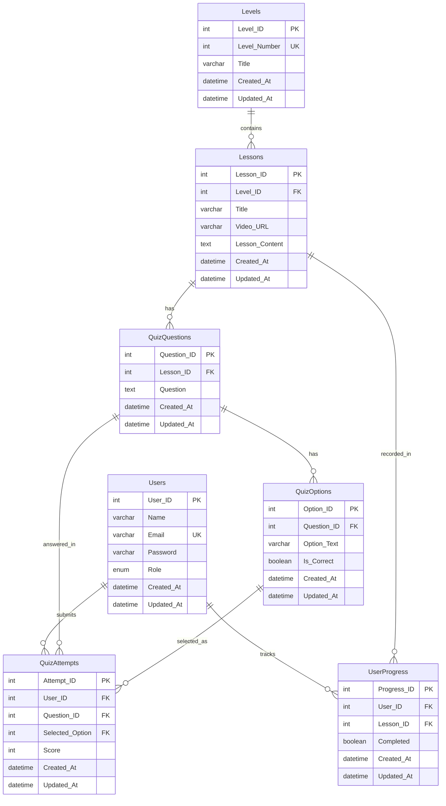

# ER Diagram · Gamlish DBMS Lab

**Live ER diagram (share this):**  
[https://dbdiagram.io/d/gamlish_dbms_lab-6a803de8e093539a9ebf8e38](https://dbdiagram.io/d/gamlish_dbms_lab-6a803de8e093539a9ebf8e38)

A ready image is in `docs/er-diagram.png`. You can put that file in the PDF.

The same model is in `er-diagram.dbml` if you need to edit it on dbdiagram.io.

## Entity Relationship Diagram

## Cardinality

| Relationship | Type | Rule |
|---|---|---|
| Levels to Lessons | 1 to M | One level has many lessons |
| Lessons to QuizQuestions | 1 to M | One lesson has many questions |
| QuizQuestions to QuizOptions | 1 to M | One question has many options |
| Users to UserProgress | 1 to M | One user has many progress rows |
| Lessons to UserProgress | 1 to M | One lesson is tracked for many users |
| Users to QuizAttempts | 1 to M | One user submits many answers |
| QuizQuestions to QuizAttempts | 1 to M | One question is answered by many users |
| QuizOptions to QuizAttempts | 1 to M | One option can be selected in many attempts |

`Selected_Option` is a foreign key to `QuizOptions.Option_ID`. This keeps answers relational (3NF) instead of storing free text.

## How to export a picture for the PDF

1. Open [https://dbdiagram.io](https://dbdiagram.io).
2. New diagram. Paste the contents of `er-diagram.dbml`.
3. Export as PNG or PDF.
4. Put the image in the report under Proposed Database Design.
